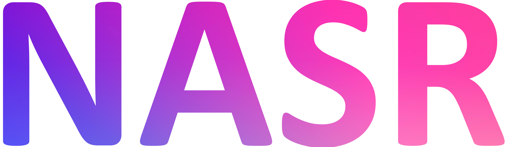
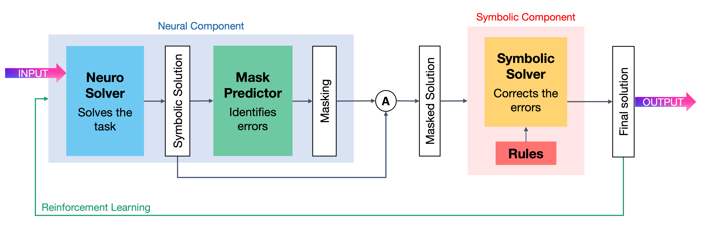
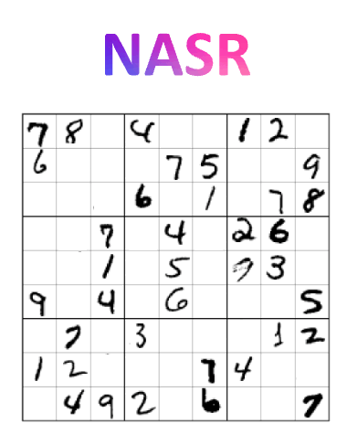

#  - Neural Attention for Symbolic Reasoning

This repository contains the code for the paper ``Learning Where and When to Reason in Neuro-Symbolic Inference`` (ICLR-2023).
<p align="center">

</p>

The code is also here: https://github.com/SamsungLabs/NASR

## Code for Visual Sudoku

Take a look at the [Code & Data README](src/README.md) for Installation and How-to-run instructions.
<p align="center">

</p>

## Paper & slides

The paper can be found here: [ICLR publication](https://openreview.net/forum?id=en9V5F8PR-)

NeSy presentation slides can be found here: [slides](mix/NeSy_no_animations.pdf)

ICLR poster can be found here: [poster ICLR](mix/Poster%20ICLR.pdf)

### How to cite:

```
@inproceedings{cornelio_2023_NASR,
title={Learning where and when to reason in neuro-symbolic inference},
author={Cristina Cornelio and Jan Stuehmer and Shell Xu Hu and Timothy Hospedales},
booktitle={The Eleventh International Conference on Learning Representations (ICLR) },
year={2023},
url={https://openreview.net/forum?id=en9V5F8PR-}
}
```
